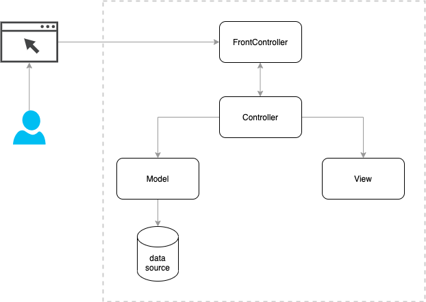

# Simple implementation of MVC pattern for training reference

# Dependencies
This SimpleMVC framework uses two libraries
- [phpdotenv](https://github.com/vlucas/phpdotent) for handling configuration from .env file
- [router](https://github.com/bramus/router) for implementing frontcontroller multiplexer(router)

# How to implement Simple MVC framework using PHP
## [Intro MVC pattern](https://en.wikipedia.org/wiki/Model–view–controller)

## 

- FrontController: This conponent function is to bootstrap application configurations and settings then based on
the requested URI it needs to figure out the corresponding Controller and dispatchs the request to the appropriate
controller method to handle the request and return response back to the user.
- Controller: This collaborator component will call Service, Model components to calculate data for rendering view template
and return the final html file to the user
- Model: This component is used to interface with datasource, mostly database.
- View: Contains the representation of data, in web application this should be the template used to generate final HTML file for sending to user.


### Setup composer project

Run the follwing command to setup project with [Composer](https://getcomposer.org)
```bash
# make new directory and change to new directory
mkdir SimpleMVC && cd SimpleMVC

# Init composer project and enter basic project info follow by composer hints
composer init

```

After above step a composer.json file will be created on SimpleMVC directory with following content

```json
{
    "name": "phucngodev/simplemvc",
    "description": "Implement MVC pattern using PHP, this is used for training",
    "license": "MIT",
    "authors": [
        {
            "name": "Phuc",
            "email": "ngovanphuc@hotmail.com"
        }
    ],
    "require": {
    }
}
```

### Create folder structure

```bash
mkdir {app,bootstrap,public,routes}
mkdir {app/Core,app/Controllers,app/Models,app/Views,app/Utils}

```

After above step your folder structure should looks like the following
```bash
.
├── app
│   ├── Controllers
│   ├── Core
│   ├── Models
│   ├── Utils
│   └── Views
├── bootstrap
├── composer.json
├── public
└── routes
```

### Implement FrontController
The FrontController is the first file receive and process the request. Normally, it's the index.php file
within WEBROOT directory, in this case our webroot directory is public folder

Main functions of FrontController is to bootstrap the framework, setup configurations, initialize database,
and dispatchs request to the corresponding controller methods based on request URI for futher processing the request.

To dispatch request to the corresponding controller method we can use information from request URI to determine the controller and its methods and then calls its methods

For example: a GET Request to the post page http://simplemvc.local/posts

Then the request URI is posts, based on this we can deduce this the controller is PostController and the methods is default method index for example.

wen can create an instance of PostController class and call its index method
```php
    $postController = new PostController();
    return $postController->index();
```

This is basic idea of dispatching request to controller. For this tutorial I'm going to user a simpe implementation of this logic
[SimpleRouter](https://github.com/bramus/router)

so lets install this library using composer

```bash
    composer require bramus/router
```

### Setup PSR-4 autoload
open composer.json file and adds the psr4 session like the following
```json
{
    "name": "phucngodev/simplemvc",
    "description": "Implement MVC pattern using PHP, this is used for training",
    "license": "MIT",
    "authors": [
        {
            "name": "Phuc",
            "email": "ngovanphuc@hotmail.com"
        }
    ],
    "autoload": {
        "psr-4": {
            "App\\": "app/"
        },
        "files": [
            "app/Utils/utils.php"
        ]
    },
    "require": {
        "bramus/router": "^1.4"
    }
}
```

Load authload.php file in the frontcontroller

```php
// public/index.php
<?php

// Project root path
define('APP_ROOT', __DIR__  . '/../');

require __DIR__.'/../vendor/autoload.php';

```

We should put as litter code as posible in this index.php file, so we will create a class to handle application bootstrap
lets create the following files
```bash
touch app/Core/App.php
touch app/Utils/utils.php
touch bootstrap/app.php
touch app/Core/Route.php
```


### Implement Rotue, and App bootstrap class

The Route class is a simpe wrapper around bramus/router library to support static methods for ease of use later

```php
// app/Core/Route.php
<?php

namespace App\Core;

use Bramus\Router\Router;

/**
 * Thin wrapper of Bramus\Router\Router class
 */
class Route
{
    /**
     * @var Bramus\Router\Router
     */
    private static $router = null;

    /**
     * Registe GET request
     *
     * @param string $pattern request URI pattern https://github.com/bramus/router#dynamic-pcre-based-route-patterns
     * @param $handler controller function to handle this request when it matches
     *
     * @return void
     */
    public static function get(string $pattern, $handler)
    {
        static::getRouter()->get($pattern, $handler);
    }

    /**
     * Registe POST request
     *
     * @param string $pattern request URI pattern https://github.com/bramus/router#dynamic-pcre-based-route-patterns
     * @param $handler controller function to handle this request when it matches
     *
     * @return void
     */
    public static function post(string $pattern, $handler)
    {
        static::getRouter()->post($pattern, $handler);
    }

    /**
     * Registe PUT request
     *
     * @param string $pattern request URI pattern https://github.com/bramus/router#dynamic-pcre-based-route-patterns
     * @param $handler controller function to handle this request when it matches
     *
     * @return void
     */
    public static function put(string $pattern, $handler)
    {
        static::getRouter()->put($pattern, $handler);
    }

    /**
     * Registe DELETE request
     *
     * @param string $pattern request URI pattern https://github.com/bramus/router#dynamic-pcre-based-route-patterns
     * @param $handler controller function to handle this request when it matches
     *
     * @return void
     */
    public static function delete(string $pattern, callable $handler)
    {
        static::getRouter()->delete($pattern, $handler);
    }

    public static function getRouter()
    {
        if (static::$router === null) {
            static::$router= new Router();
        }

        return static::$router;
    }
}
```


Now lets create App class and config this dispatch class in this class
```php
// app/Core/App.php
<?php

namespace App\Core;

use App\Core\Route;

class App
{
    /**
     * Initialize and start application
     *
     */
    public function run()
    {
        $this->setupRouter();
    }

    /**
     * Setup front controller(router)
     *
     */
    protected function setupRouter()
    {
        $router = Route::getRouter();
        $router->setNamespace('\App\Controllers');

        // Include routes definitions
        require_once APP_ROOT . '/routes/web.php';

        $router->run();
    }

}

```

Create an instance of this App class and start the application in FrontController public/index.php

```php
//bootstrap/app.php
<?php

$app = new App\Core\App;

return $app;

```

```php
//public/index.php
<?php

// Project root path
define('APP_ROOT', __DIR__  . '/../');

require __DIR__.'/../vendor/autoload.php';


$app  = require_once __DIR__.'/../bootstrap/app.php';
$app->run();

```

The next thing is we need to add a rewrite rules so that we dont have to include frontcontroller for every request URI

// public/.htaccess
```htacess
<IfModule mod_rewrite.c>
    <IfModule mod_negotiation.c>
        Options -MultiViews -Indexes
    </IfModule>

    RewriteEngine On

    # Redirect Trailing Slashes If Not A Folder...
    RewriteCond %{REQUEST_FILENAME} !-d
    RewriteCond %{REQUEST_URI} (.+)/$
    RewriteRule ^ %1 [L,R=301]

    # Send Requests To Front Controller...
    RewriteCond %{REQUEST_FILENAME} !-d
    RewriteCond %{REQUEST_FILENAME} !-f
    RewriteRule ^ index.php [L]
</IfModule>
```

### Let make simple controller and test the dispatch function
```bash
touch app/Controllers/HomeController.php
touch routes/web.php

```

```php
// app/Controllers/HomeController.php
<?php

namespace App\Controllers;

use App\Core\Controller;

class HomeController extends Controller
{

    /**
     * Home page
     *
     * @return html
     */
    public function index()
    {
        echo __CLASS__ . __FILE__;
    }
}
```

Register home page route
```php
// routes/web.php
<?php

use App\Core\Route;

Route::get('/', 'HomeController@index');
```

The folders and files afer above steps should looks like the following
```bash
├── README.md
├── app
│   ├── Controllers
│   │   └── HomeController.php
│   ├── Core
│   │   ├── App.php
│   │   ├── Route.php
│   ├── Models
│   ├── Services
│   ├── Utils
│   └── Views
├── bootstrap
│   └── app.php
├── composer.json
├── composer.lock
├── public
│   ├── index.php
├── routes
│   └── web.php
└── vendor
```


If you setup a webserver with webroot points to SimpleMVC/public, you should be able to make request to
localhost and it will return the text in HomeController@index

### I've also implemented other classes like app/Core/View.php, app/Core/Controller.php, app/Core/Session.php
you can read those classes to learn how to configure and setup other things like View template, Session,...,
